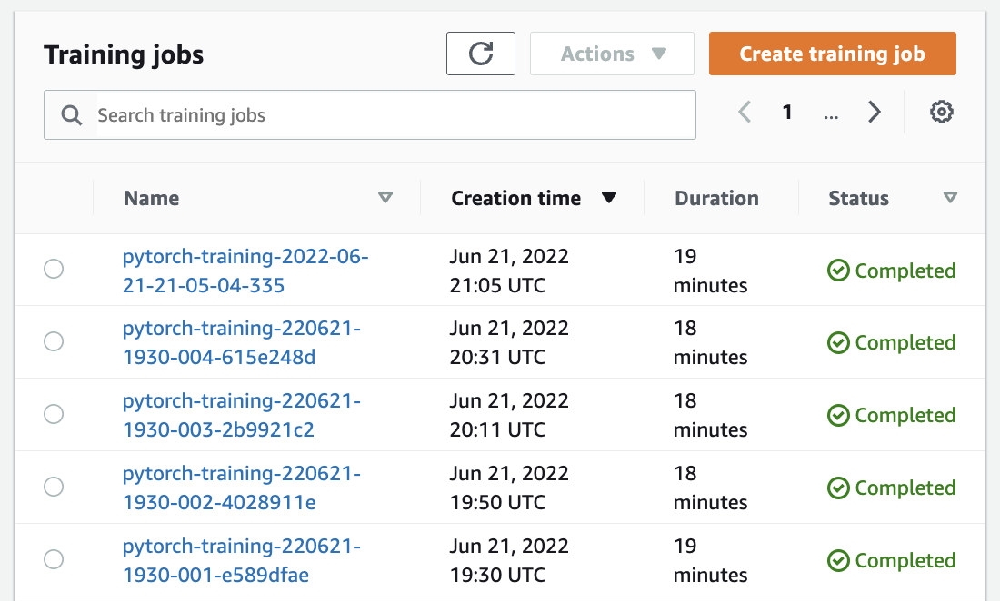
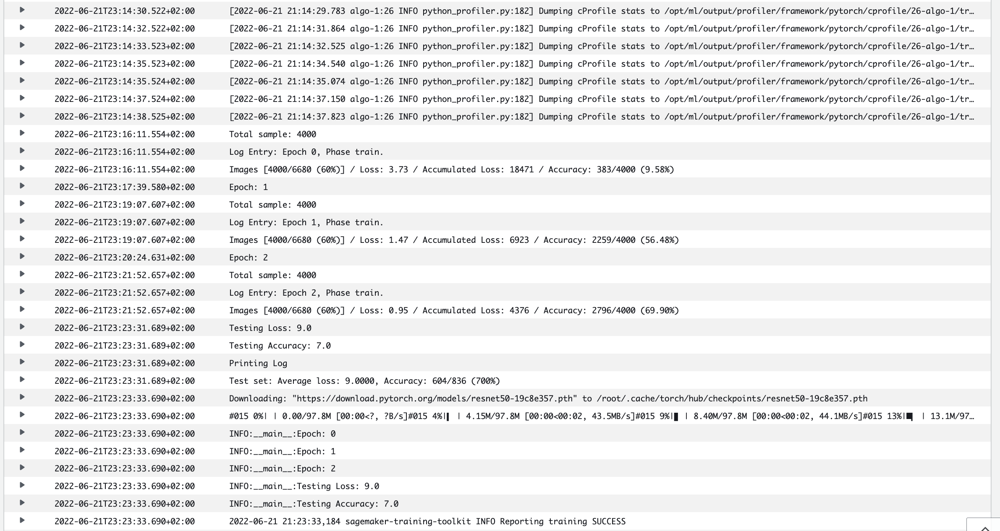
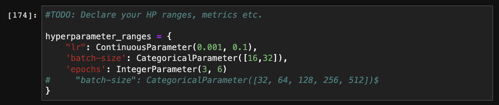
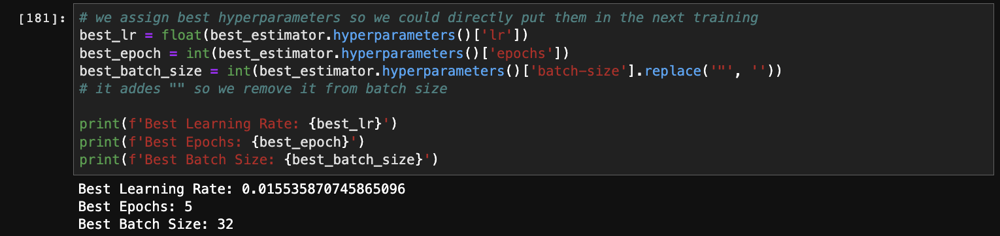
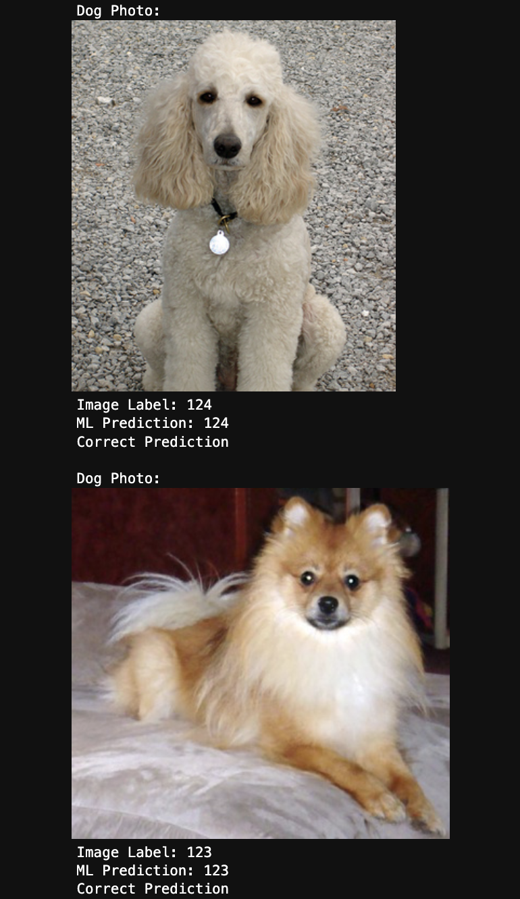
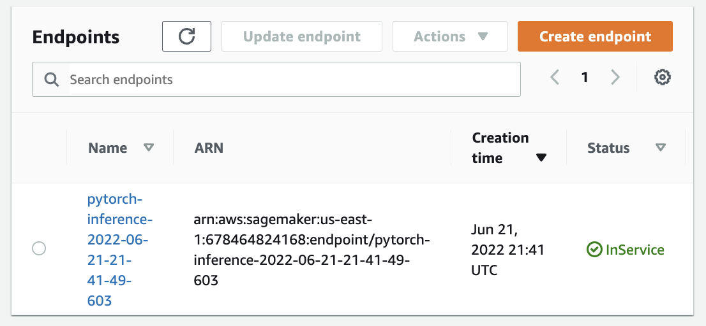

# Image Classification using AWS SageMaker

Use AWS Sagemaker to train a pretrained model that can perform image classification by using the Sagemaker profiling, debugger, hyperparameter tuning and other good ML engineering practices. This can be done on either the provided dog breed classication data set or one of your choice.

## Project Set Up and Installation
Enter AWS through the gateway in the course and open SageMaker Studio. 
Download the starter files.
Download/Make the dataset available. 

## Dataset
The provided dataset is the dogbreed classification dataset which can be found in the classroom.
The project is designed to be dataset independent so if there is a dataset that is more interesting or relevant to your work, you are welcome to use it to complete the project.

### Access
Upload the data to an S3 bucket through the AWS Gateway so that SageMaker has access to the data. 

## Hyperparameter Tuning
What kind of model did you choose for this experiment and why? Give an overview of the types of parameters and their ranges used for the hyperparameter search

- I used Resnet50 which is pretrained deep learning model for image classification. I am familiar with this model, and it has an image input size of 224x224. It allows CNN to go deep with 50 layers. For hyperparameter tuning, I used batch size, epochs and learning rates. Actually i excluded epochs first but after testing, I have seen that optimizing epochs provided better results. The ranges were: 

    "lr": ContinuousParameter(0.001, 0.1),
    'batch-size': CategoricalParameter([16,32]),
    'epochs': IntegerParameter(3, 6)

Remember that your README should:
- Include a screenshot of completed training jobs
- Logs metrics during the training process
- Tune at least two hyperparameters
- Retrieve the best best hyperparameters from all your training jobs

## Completed Training Jobs

## Training Logs Metrics

## HyperParameter Tuning

## Top HyperParameter Parameters

## Debugging and Profiling
**TODO**: Give an overview of how you performed model debugging and profiling in Sagemaker

- I followed debugger/profiling exercise step by step as a guideline. First I imported the client library, then ensured that I define hook and register the model in my training script. For train and valid phases, I set the required modes. In my jupyter notebook I finally established the rules and defined the configurations. This was challenging as it was defining interval_millis. I wanted to investigate the rules of loss_not_decreasing, LowGPUUtilization and ProfilerReport.

### Results
**TODO**: What are the results/insights did you get by profiling/debugging your model?

- buraya

**TODO** Remember to provide the profiler html/pdf file in your submission.

- available as html file in the folder

## Model Deployment
**TODO**: Give an overview of the deployed model and instructions on how to query the endpoint with a sample input.

- buraya

### Sample Deployment

**TODO** Remember to provide a screenshot of the deployed active endpoint in Sagemaker.

### Active Sagemaker Endpoint

## Standout Suggestions
**TODO (Optional):** This is where you can provide information about any standout suggestions that you have attempted.
